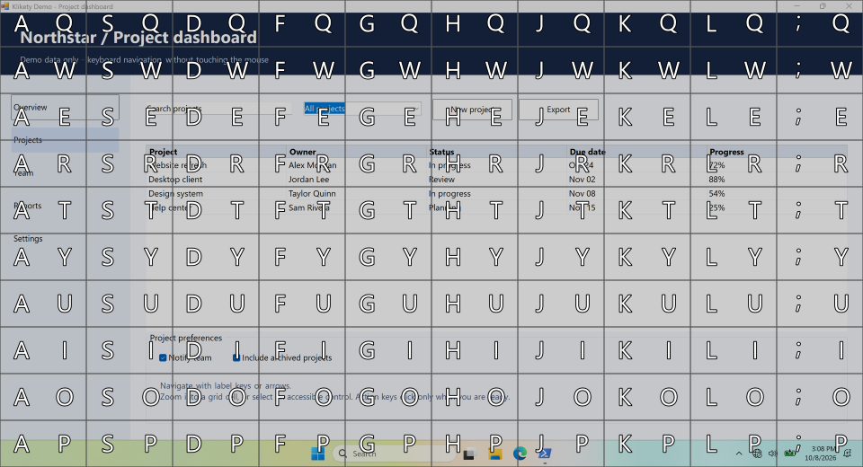

# Klikety

**Point, click, and drag without reaching for the mouse.**

Klikety is a keyboard-driven mouse navigator for Windows. Press a hotkey,
narrow down a screen location or choose an accessible control, then send a
mouse action. It runs in the system tray and works without elevation or remote
services.

Five modes, nested control hints, and progressively finer grids in one loop.
Selection previews the cursor; it does not click. This is an animated PNG (APNG);
unsupported viewers show the first frame. [Static screenshots and controls](docs/navigation.md).

## Navigation modes

| Mode | How it targets |
|---|---|
| **UniformGrid** | A two-key screen grid with progressively finer subgrids. The default starting mode. |
| **Crosshair** | Uniform horizontal and vertical axes for selecting an intersection. |
| **LogCrosshair** | Cursor-centered axes: small steps nearby, larger steps farther away. |
| **LogGrid** | Logarithmic cells that recenter after each two-key selection. |
| **ElementHints** | Opt-in labels on the foreground app's accessible controls, with groups for nested actions and grid fallback. |

Switch modes while navigation is active, before selecting a target. Labels follow
your keyboard layout; optional arrows and app-window scoping provide other ways
to narrow the target.

## More than pointing

- **Mouse actions:** left, right, middle, and double clicks; move-only; two-point
  drag-and-drop; modifier-aware clicks.
- **Scrolling:** configurable global wheel shortcuts, with a tray pause toggle.
- **Macros:** ten recording/playback slots, screen or window-relative coordinates,
  configurable timing, and a visual click indicator.
- **Contextual help:** an overlay keyboard showing the commands available now.
- **Native Settings:** a seven-page editor with shortcut capture, draft/save
  workflow, and comment-preserving JSONC configuration.
- **Personalization:** dark/light/custom overlay themes, readable outlined labels,
  and an optional key-press HUD.
- **Tray controls:** quick access to Settings, reload, startup registration, and Quit.

**Windows 10 or later.** [Get started](docs/getting-started.md) with a release or
build from source.

[Documentation](docs/README.md) · [Navigation](docs/navigation.md) ·
[Settings and files](docs/settings.md) · [Macros](docs/macros.md) ·
[Development](docs/development.md)

[MIT license](LICENSE)
