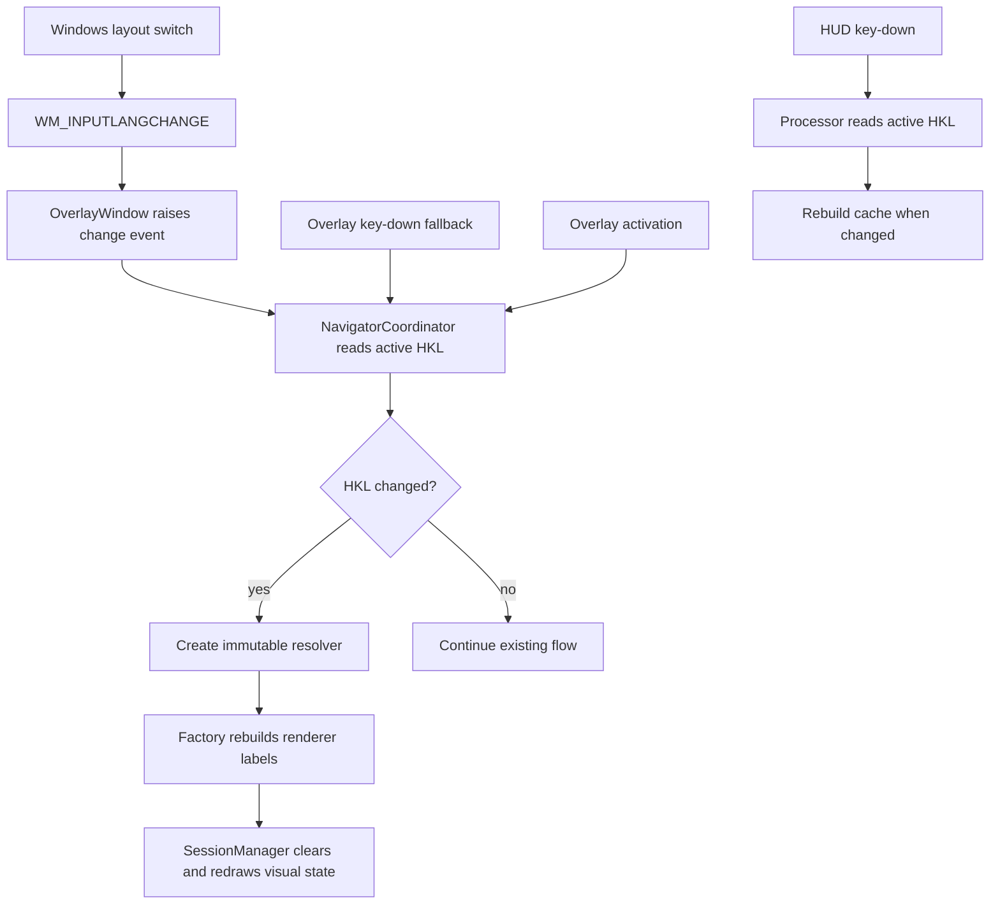

# Approved Design

## Components and boundaries

- `LabelGenerator` and `AxisLabelGenerator` retain their configured VKey arrays and rebuild their resolved lookup caches in place.
- `IGridRenderer`, `ICrosshairRenderer`, `ILogCrosshairRenderer`, and `ILogGridRenderer` expose `RebuildLabels`; `ModeSessionFactory` forwards one resolver to each instantiated renderer.
- `OverlayWindow` attaches a `WM_INPUTLANGCHANGE` hook after it obtains an `HwndSource`, compares the message HKL with its last value, and raises `KeyboardLayoutChanged`. It detaches the hook in `Hide`.
- `NavigatorCoordinator` compares `IKeyboardLayoutProvider.GetActiveKeyboardLayout()` to its last HKL on activation, after the event, and on each non-debounced key-down. A change rebuilds labels and redraws the active session.
- `KeyPressProcessor` takes `IKeyboardLayoutProvider` and a resolver factory. It performs one HKL comparison per key-down and rebuilds only after a changed handle.
- Sessions record their last render operation with its offsets and arguments. `Redraw` replays that command without driving their state machines. `LogGridRenderer` resolves the first-key indicator label from its own column labels.

## Program flow

## Optional call stacks

The Mermaid flow is sufficient. Layout messages notify; the coordinator is the sole authority that reads the active layout and creates resolvers.
