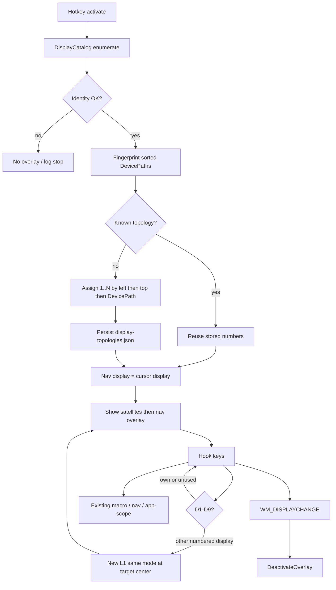

# Approved Design

## Components and boundaries

- **`IDisplayCatalog` / `DisplayCatalog`**: `EnumDisplayMonitors` + `GetMonitorInfoW` (`MONITORINFOEX.szDevice`, `rcMonitor`) + CCD `QueryDisplayConfig` / `DisplayConfigGetDeviceInfo` for DevicePath. Match GDI name to CCD path. Expose virtual-screen rect (`SM_XVIRTUALSCREEN` / `Y` / `CX` / `CY`) and the display containing a physical point. Empty/duplicate DevicePath or CCD-active-count ≠ monitor count → do not return a partial map (caller dismisses / refuses numbering).
- **`DisplayTopologyStore`**: load/save topology maps keyed by fingerprint. Unknown fingerprint → assign `1..N` by `(Left, Top, DevicePath)` ordinal, persist. Known → reuse numbers. Cap at 9 numbered displays.
- **`OverlayHost`**: one `OverlayWindow` (nav) + N−1 `SatelliteWindow`. Satellites: `ShowActivated=False`, `WS_EX_NOACTIVATE | WS_EX_TOOLWINDOW | WS_EX_TRANSPARENT`, never `Activate()`. Show satellites first, then nav with existing `Show(bounds)` + `Activate()`. During host show/hide, coordinator uses the existing `_switching` / focus-lost guard so satellite create cannot dismiss the session.
- **`SatelliteWindow`**: centered outlined digit, theme label fill/outline. Font size = 40% of min(DIP width, DIP height), clamp 96–400.
- **Digit dispatch** (coordinator, after debounce, **before** `MacroHandler.TryHandleKey`): if overlay visible and key is D1–D9 bound to another display → switch; same display → no-op consume; unbound → ignore (pass to later handlers only if not a display key — display keys are always consumed while overlay is visible so they cannot type into the session). Switch: hide satellites, move nav to target `rcMonitor`, `MoveTo` target center, cancel app-scope and drag, `ActivateDefaultSession` with **current mode name** at L1, rebuild satellites. Numbers unchanged.
- **Live change**: nav `HwndSource` handles `WM_DISPLAYCHANGE` → `DeactivateOverlay()`.
- **Mouse**: `NormalizeAbsolute(point, virtualScreen)` with `MOUSEEVENTF_ABSOLUTE` and `MOUSEEVENTF_VIRTUALDESK`. Pure helper unit-tested with origin ≠ (0,0).
- **DPI**: application manifest Per-Monitor V2. Each overlay window sizes from its own `PresentationSource` transform. Overlay DIP size must match `GetDpiForMonitor` for that `HMONITOR`.
- **App-scope**: `Rectangle.Intersect(hwndBounds, ActiveNavDisplay.rcMonitor)`. Empty → existing flash + stay full-display.
- **Config v7**: default `macros.slotKeys` = F1–F10. Migrate only when current array is exactly D0–D9. Validation rejects D1–D9 in slotKeys, horizontalKeys, verticalKeys, actionBindings, and chord keys.
- **Macros**: still primary bounds + primary DPI. Out of scope.

## Program flow

## Optional call stacks

Mermaid flow is sufficient. Digit path is coordinator-owned so `MacroHandler` does not see D1–D9 while the overlay is visible.
