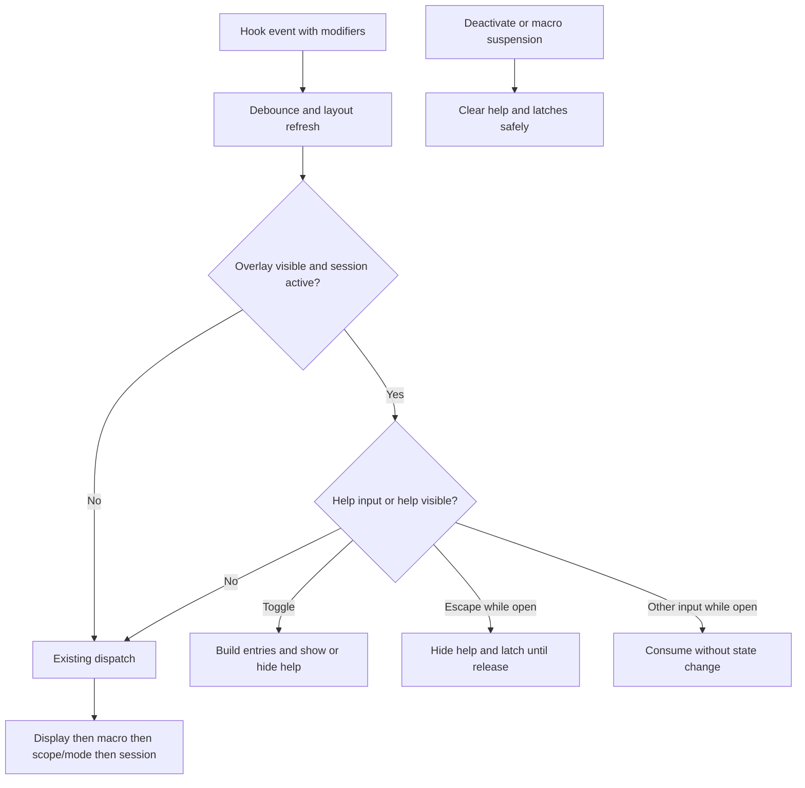

# Design

## Outcome and proposed behavior

A dedicated layer above the navigation canvas presents two keyboard halves offset around the active display's center, slightly below its horizontal center. Faint unlabeled navigation anchors retain row orientation; command keycaps have prominent layout-aware glyphs and short labels. Space is below the gap and macro function keys above the halves. Auxiliary entries cover off-block custom bindings and global scroll chords.

Help is toggled by configurable OemQuestion with optional Shift by default. Escape closes help before ordinary back-navigation. Toggle/close keys remain latched until release to avoid repeating into navigation. Other overlay inputs are consumed while help is visible; existing global OS shortcuts remain live.

See [requirements](requirements.md) and [decisions](decisions.md) for acceptance and boundaries.

## Components and boundaries

- Config section and conservative base-key collision validation; no new global registration. Versioned migration adds defaults when collision-free or persists disabled help with a warning. Invalid explicit help bindings do not dispatch at runtime, even when application startup continues after a validation notification.
- Modifier snapshot carried by hook event in separate Shift/Ctrl/Alt/Win flags; compatible optional/default third argument preserves existing consumers. No dispatcher-time modifier query or extension of mouse ActionModifiers.
- Typed help builder uses actual effective bindings and runtime availability. Reuse shared action resolution rather than rebuilding implicit Space logic independently.
- Read-only macro/drag/session projections describe recording prompts and target-button meanings.
- A composed view/layout helper renders inside OverlayWindow; independent layer survives navigation-canvas redraw. Coordinator-owned idempotent ClearHelpState clears visibility and latches before hide, macro suspension, deactivation or disposal.
- Global macro picker activation with visible navigation reuses helper-picker hook-disable/suspend behavior before Show, clearing help without full session deactivation. Existing close/resume behavior is retained.
- Help opens after both visibility and session activation are established; activation-period presses are ignored. Key-up retains debounce removal, releases help/Escape latches, and returns without toggling.
- Refresh visible help on the existing keyboard-layout path; one viewport-change signal from SizeChanged/DpiChanged relays out help without changing session state.
- Theme styles separate category, active, muted, and text treatment; colors supplement command labels.
- Canonical VKey keyboard approximation, not physical scan-code normalization across arbitrary layouts. Active-layout symbols are refreshed through existing resolver infrastructure; shifted symbol resolution is a narrow extension if necessary.

## Program flow

## Tradeoffs and open choices

- In-window rendering avoids focus transfer and hidden-session restoration; requires independent visual-layer cleanup.
- Base-key collision rejection is conservative because existing handlers ignore modifiers. Conflict-aware migration disables default help for existing conflicting configs; invalid explicit bindings do not run. Conflicts get actionable validation, not rebindings.
- Help retains recording timing; reading it can lengthen a recording delay. This is confirmed scope, not a recording pause.
- Split positions stay fixed while viewing; central gap exposes the target but help still covers some grid.
- Confirmed visual bounds: 800x600 DIP or larger with 12 DIP command text floor. Below that, contained scrolling preserves entry access; long names use compact key labels with full auxiliary names.
- Versioned conflict-aware migration follows current conventions without rewriting user bindings.

## Optional call stacks

The program-flow diagram is sufficient; no new call stack contract.
