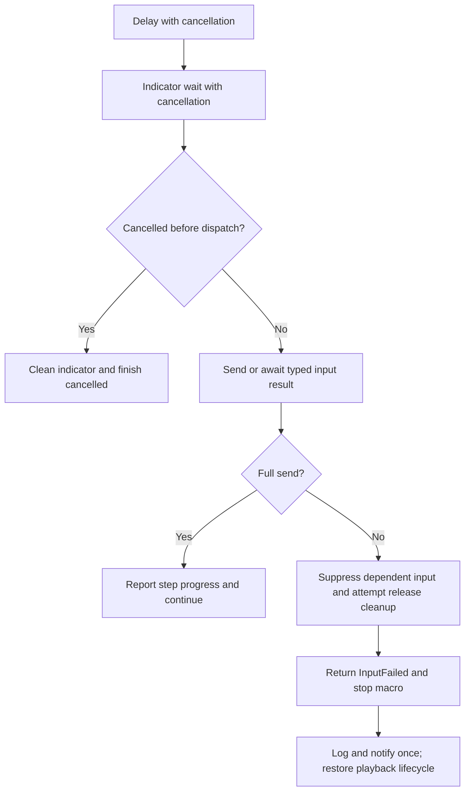

# Approved Design

Lightweight RFC; operator confirmed the complete planning context on 2026-10-04.

## Outcome and proposed behavior

Deliver four corrections with no macro-file migration or optional composition redesign. Requirements and acceptance evidence are in [requirements.md](requirements.md); scope and delegated bounds are in [intent.md](intent.md).

## Components and boundaries

- Pass CancellationToken from MacroPlayer to ExecuteStep/IClickIndicator. Check cancellation after awaits and before mouse-service dispatch, including the no-indicator path. Propagate OperationCanceledException into the existing MacroHandler cancellation handling.
- Indicator completion and cancellation use one guarded lifecycle on the dispatcher. Stop animation, hide the window, detach completion handlers and dispose cancellation registration on either terminal path. A queued stale completion does not complete/hide a later invocation. Already-cancelled tokens do not show the window. Compose a pure internal lifecycle controller with fakeable dispatcher/view operations and a production WPF adapter; cancellation/completion/reuse tests verify cleanup without a WPF/STA fixture.
- Replace MacroHandler.Dispose's synchronous playback drain with nonblocking teardown: initiate cancellation and return, let the playback operation own eventual CTS/task cleanup, and serialize UI resource closure on the dispatcher. A generation/operation identity guard prevents stale completion from affecting replacement state during reload/reset. Cover quit/reload/disposal paths; no timeout or swallowed exception substitute.
- Add a strongly typed input result carrying requested/sent counts, failing stage, native diagnostic availability and cleanup failure. Keep Win32 transport behind a small internal injectable seam; avoid exposing unmanaged arrays through public app APIs.
- Return failure when movement is incomplete and suppress its dependent click. For partial button/modifier batches, derive potentially held synthetic inputs from the sent prefix and attempt one release batch. Capture primary diagnostics before cleanup changes last-error state; cleanup failure does not erase the original failure.
- Apply explicit result checks to move/click/scroll/drag/clear-modifiers and compensation paths. Preserve normal successful batch ordering and the existing three-phase native drag delays. Replace unobserved fire-and-forget drag with asynchronous result ownership; MacroPlayer awaits the drag result before counting progress or starting the next saved interval. This intentionally removes current overlap and can add about 150 ms before the following step's delay begins. A two-step drag-to-action test verifies sequencing while saved values and speed/native phase calculations remain unchanged.
- Wire all callers/fakes. MacroPlayer stops the sequence on failure with a distinct InputFailed result, no completed-step event for that step and a diagnostic message. MacroHandler reports failure through the typed result and one error log, closes progress/restores its normal state. Non-macro callers observe/log failures. No new tray event, notification abstraction or notification requirement.
- Repair plan 000021 using evidence-backed ownership. Give retained records distinct identities using existing ID allocation, restore/correct assets and affected incoming links, retain historical wording/evidence. Stop for operator choice if ownership is unresolved. No installed script changes or archival. Add a scoped check at scripts/Test-KeyboardLayoutPlanRecords.ps1 using existing read-only index/state helpers, with expected identities/paths supplied after ownership is settled. Assert no parse errors, one inventory row per retained identity, full supported state identity/path/markers/progress/next-step shape, and resolved local Markdown links in touched assets and affected incoming references. Record its actual passing command outcome under test:PlanIdentityRepairChecks; do not substitute existing file markers.
- Update macro timing guidance to match interval semantics; update interop/macro/testing notes with delivered APIs. No unrelated stale-doc sweep.

## Program flow

## Tradeoffs and open choices

- Typed outcomes broaden caller changes, as explicitly selected by the operator, but prevent failed macro steps appearing completed.
- Awaiting drag completion prevents overlap and reveals failures; preserve native phase delays rather than redesigning drag mechanics. The completion-relative next-step schedule was explicitly selected after review.
- Native cleanup is best-effort with a visible failure, not a guarantee against OS rejection; no action retries.
- Identity ownership remains a bounded evidence-dependent choice; unresolved evidence stops record mutation.
- Historical Decisions from 015/017 could not be accepted by the bounded reader; do not bypass its refusal. Current code and active design notes are the planning baseline.

## Optional call stacks

The program-flow diagram and named ownership boundaries are sufficient.
