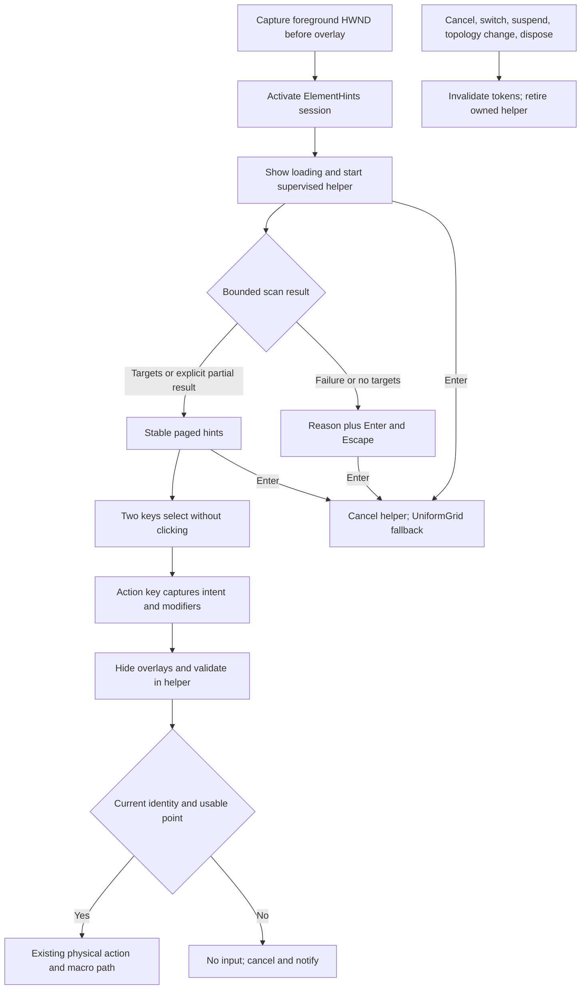

# Approved Design

## Outcome and proposed behavior

A fifth mode, `ElementHints`, labels interactive controls in the foreground application's UIA subtree. The confirmed choices and whole-plan approval are recorded in [intent](intent.md); approved defaults and limits are in [decisions](decisions.md). Approved for implementation on 2026-10-07; verification evidence is still outstanding.

Approved user flow:

1. Enable `modes.elementHints`; keep the existing grid default. Activate Klikety and press its configured chord (proposed Tab).
2. Show "Finding controls..." immediately. Discovery uses the HWND captured before overlay Show, clipped to the navigation display and current app-scope bounds.
3. Render stable two-key labels using the configured horizontal/vertical key pairs. The first key filters labels; the second selects/highlights one target and previews the cursor point. No click occurs.
4. Space/custom action keys dispatch the existing click/move/drag action after fresh target validation. Actions without a selected target are rejected visibly, not applied at the original cursor.
5. Left/Right change pages when needed. Escape clears a prefix/selection, then cancels from the neutral state. Enter switches to UniformGrid from any state, including loading/failure/locked selection.
6. No-target/provider/timeout states explain the result and retain Enter/Escape. No silent automatic fallback. Partial results say they are partial.

The UIA mode can be configured as default, but it does not opt users into a new default during migration. UniformGrid must remain enabled as its fallback.

## Components and boundaries

### Helper and supervisor

- Add a windowless `Klikety.UiaWorker` executable targeting the repository's .NET 10 Windows stack. Use `System.Windows.Automation` via supported WindowsDesktop references first; confirm compilation before selecting additional interop machinery.
- One MTA worker thread owns all UIA calls, cached properties, root identity, and retained snapshot elements. No UIA object crosses process/thread boundaries into Klikety.
- A helper remains alive for the active snapshot so `ValidateTarget` can query the same element identity. Scan replacement/suspension/deactivation terminates it; no continuous UIA event subscription.
- Parent/child communicate through inherited redirected stdin/stdout, not a public endpoint. Length-bounded, versioned JSON DTOs carry request/session IDs, the target HWND/identity, physical bounds, candidate tokens, and typed outcomes. Read streams with byte limits rather than unbounded `ReadToEnd`/line allocation. Drain bounded stderr separately.
- Resolve the executable under `AppContext.BaseDirectory` in a dedicated bundled subfolder. Use no shell/PATH lookup or user-supplied executable path.
- The parent's absolute deadline covers launch, protocol, traversal, and response. Cancellation/timeout kills only the owned process, asynchronously observes exit, and invalidates its tokens. Assign the helper to an owned kill-on-close Windows job before permitting UIA work, so a parent crash does not orphan it; do not assign the target app or unrelated processes. Termination/exit observation itself has a bounded cleanup deadline.
- Replace a helper only after the previous owned process exits; if teardown fails, disable that attempt visibly rather than accumulate workers. Production disposal must not synchronously wait on UIA/pipe reads.
- Typed expected failures include timeout, no targets, access denied, provider failure, stale target, process start/exit failure, protocol mismatch, and malformed/oversized output. Preserve error codes/reasons without logging control contents.

### Discovery and candidate policy

- Start with `AutomationElement.FromHandle(capturedHwnd)` and bounded control-view traversal; avoid unbounded `FindAll` on the desktop/root.
- Cache necessary properties/capability availability per visited element. Require valid finite physical bounds intersecting the active region, enabled state, and not offscreen.
- Include standard buttons, links, checkbox/radio/toggle controls, editable/readonly edit controls, combo boxes, tabs/tab items, menu items within the captured subtree, selectable list/tree/data items, sliders/spinners, and custom controls advertising relevant interaction patterns.
- Do not include arbitrary panels/documents because they are focusable, or every TextPattern element. Deduplicate repeated runtime identity and passive descendants of an already actionable target, without merging different adjacent/overlapping controls by name or rectangle alone.
- Exclude Klikety's own process/root. Do not reject all descendants with a different PID: browser/provider process boundaries are legitimate.
- Snapshot DTOs need identity, control type/capabilities, bounds, and provisional point, not textbox values, password contents, document text, or a persistent tree dump. Names are unnecessary for keyboard hints.
- If a node fails, account for the skipped branch and return explicit partial status; if the root fails, return a typed failure. On traversal/target limits return bounded partial candidates and an incomplete reason. The hard deadline discards an unfinished scan unless a complete bounded partial response has already arrived.
- Do not infer "unsupported application" conclusively from an empty tree; display "No controls found; Enter for grid".

### Selection and rendering

- Sort retained targets deterministically by physical top/left and a stable within-snapshot tie-breaker. Labels are horizontal-first/vertical-second Cartesian pairs; reuse `IKeyLabelResolver`/existing label helpers rather than create a second layout interpretation.
- Page capacity is bounded by key-pair capacity and actual readable layout. Freeze pages/assignments once computed; prefix filtering dims or removes nonmatches without moving remaining hints.
- Escape from prefix/selection restores the neutral hint view; Escape there cancels. A new first key replaces the prefix. Invalid keys flash using existing feedback patterns.
- Left/Right page navigation clears selection/prefix; Up/Down have no navigation meaning in this first version and produce ordinary invalid-key feedback. Enter is grid fallback, not UIA invoke or grid zoom.
- Reuse `OverlayDip.WindowOrigin`, current transform/DPI, theme brushes/outlined text, and relevant layout helpers. Do not transform absolute desktop coordinates directly into canvas coordinates.
- Use compact inline hints where possible, external labels/connectors where necessary, and readable page-local list presentation when collision-free hint placement is impossible. Keep target points independent of label positions.
- `Redraw` and keyboard-layout refresh replay the snapshot without discovery or selection/cursor changes. Viewport relayout preserves assignments unless its capacity changes; then clear selection and visibly recompute pages.

### Action validation and dispatch

- A label's center is a cursor preview, not a safe click guarantee. `IsOffscreen=false` does not imply the element is unobstructed.
- On an action key, capture a typed pending intent containing action, original modifier snapshot, target token, snapshot/generation, and drag/recording context. Ignore duplicate actions while it is pending.
- Suspend/hide the whole overlay host and drain keyboard capture before validation. The coordinator owns this handoff and suppresses its own hide-related focus event, but does not suppress genuine target/activation invalidation. Preserve the helper for this transaction.
- Validate the root HWND/PID/runtime identity, selected runtime identity, current enabled/onscreen state, unchanged element bounds, active-region intersection, and point ownership. Window movement/control replacement causes rejection rather than clicking a new location under an old label.
- Prefer a current UIA clickable point. When unavailable, try a small bounded set of interior points and confirm the UIA hit-test element or an ancestry path identifies the selected control. Use a native window hit-test as an additional ownership check. Hide satellites/HUDs that would contaminate these checks, or explicitly exclude owned noninteractive windows.
- An overlapping modal dialog/other app, lost foreground after restoring the intended window, no valid point, timeout, or destroyed element rejects the intent. Recheck generation and inexpensive window/point ownership immediately before SendInput; acknowledge the unavoidable race between validation and injection.
- On rejection cancel safely, restore according to existing cancellation/drag rules, and notify through the existing tray/status routing. No action, no macro step, no automatic re-scan/retry/click.
- On success reuse ActionDispatcher/IMouseActionService. Add a narrow prepared-action path accepting the captured modifiers instead of sampling them after async delay. Preserve default-grid quick actions; the selected-target requirement applies only to ElementHints.
- UIA is detection/validation only. Avoid Invoke/SetValue/SetFocus execution because it would change modifier, right-click, drag, recording, and coordinate semantics.

### Lifecycle and current integration surfaces

- `SessionManager` currently creates sessions through initial activation, mode switch, app-scope switch, display restart, drag reset, recording resume, and playback resume. Supply the intended target context on each path; retirement invalidates all pending callbacks.
- Retain `IModeSession` for existing grids. New asynchronous/fallback capabilities can be implemented by the element session and consumed through a narrow typed seam.
- Enter fallback is a deliberate exception to ordinary mode lock, only inside the element mode. It selects UniformGrid, clears hint work, and preserves/clamps the current point in ActiveBounds.
- Display digits keep existing precedence and cancel drag. Scan the same original application clipped to the new display; if there is no intersection, show no targets and offer grid. Do not switch to another application's HWND because its display was selected.
- App-scope retains existing border/geometry semantics; it never broadens discovery beyond the captured root. Help retains dismiss-and-forward behavior and prefix/page/selection. Include ElementHints, page controls, loading/selection status, and Enter fallback in effective help content.
- The current coordinator rejects all non-Uniform modes on non-QWERTY layouts. Exempt this layout-aware mode specifically; do not alter the existing grid-mode policy.
- Macro picker/playback suspension cancels helper/pending actions. Recording resumes with the recording target, and fresh discovery if this mode is the configured default. Capture no step until target validation succeeds; preserve macro file format.
- UIA failures should not overwrite "Select drag target" or recording prompts. Add a separate scoped hint-status presentation or compose existing status content with clear ownership; clear only the mode's own status.
- Deactivate/hotkey toggle/focus loss/display topology change/config reset/disposal invalidate async work and retire the helper. Help-only hide does not retire the session.

### Configuration and distribution

- Proposed settings: `ModesConfig.ElementHints` uses the existing mode shape, disabled by default, Tab chord, `twoKey=true`, `arrowKeys=true`; these flags mean label selection and page navigation for this mode. Both are required while enabled. Shared horizontal/vertical keys remain the hint alphabet.
- Version 9 migration adds the disabled mode and preserves unknown fields/custom defaults/keys. Enabled configuration participates in every chord/action/navigation/help/macro/scroll/hotkey/display collision check and exactly-one-default validation. Invalid explicit settings make this mode ineffective with a visible violation, even if other modes continue.
- Keep grid fallback enabled; no fallback chain/configuration framework is needed. Timeouts/limits are internal constants initially, not a new public tuning surface.
- Build the worker with normal development commands and copy its required output into the app's bundled subfolder. Publish it for the same RID/self-contained/version settings as the app, with isolated runtime files. Check the release ZIP contents and execute its protocol from an extracted artifact.
- No new third-party dependency is expected. A test-only child fixture may exercise crash/hang/invalid-output supervision; production protocol has no test/hang command.

## Program flow

## Tradeoffs and open choices

- Confirmed: foreground root rather than all windows; isolated helper rather than a soft in-process timeout; explicit action rather than automatic click.
- Approved through whole-plan acceptance: opt-in settings/chord, paging/fallback controls, and numeric budgets; see `decisions.md`.
- A helper adds packaging/job/IPC work but permits reliable cleanup of a blocked UIA call. It is isolation, not a security sandbox.
- Snapshot discovery avoids continuous relabeling and stale-selection races; reopening is required after application changes. Action validation is still necessary.
- Managed UIA minimizes code/dependencies; verify actual .NET 10 references and cross-bitness coverage rather than treating older .NET Framework docs as SDK guarantees.
- Third-party app trees, IsOffscreen accuracy, hit-test behavior, and provider timing remain environmental limitations. No absolute "all clickable controls" acceptance criterion.

## Optional call stacks

The flow and boundary contracts above are sufficient; no new call-stack authority.
