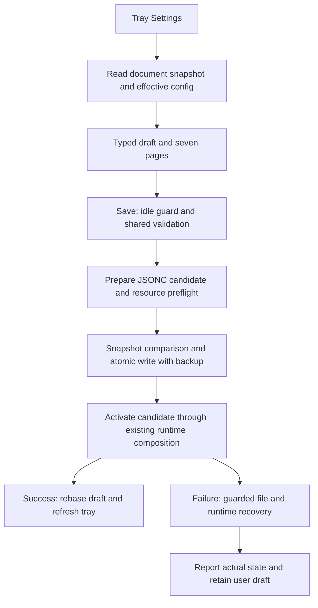

# Proposed Design

Complete draft for confirmation; the planning-confirmed marker is still pending.
Requirements and choices are in their own assets, linked from plan.md.

## Outcome and proposed behavior

Retain the inspected Windows-native sidebar, common-first cards, collapsed Advanced,
fixed footer and scrolling content. One modeless reusable window, roughly 850 x 650 DIP,
resizable/adaptive for keyboard, DPI and work area. Draft survives category changes.
Discard reads latest disk after dirty confirmation; close/quit confirms unsaved changes.
Field errors have page/field targets; save result reports actual persisted/runtime state.

### Coverage map

| Category | Common | Advanced |
|---|---|---|
| General | activation hotkey, read-only config location/version | logLevel, fileLoggingEnabled, retainedLogFileCount; read-only schema |
| Navigation | all four enable/default flags, per-mode arrow/two-key controls, chords, nullable app-scope chord | logBaseSize and logGridBaseSize for each of UniformGrid, Crosshair, LogCrosshair and LogGrid; level3CellSizeThreshold |
| Key bindings | actionBindings add/change/remove with LeftClick, RightClick, MiddleClick, DoubleClick, MoveOnly, DragDrop; ordered horizontalKeys/verticalKeys | readable reserved/collision explanation |
| Appearance | built-in/custom theme reference, minLabelFontSize | current theme path/validation details, no theme-file editing |
| Scrolling | enabled, scrollUpKey, scrollDownKey, scrollAmount | compatibility/collision help |
| Macros | enabled, nullable globalHotKey, recordKey/helperKey, ordered slotKeys, speedModifier | every playbackIndicator value: fill/stroke, thickness, initial/final radius, duration |
| Key-press HUD | fontSize/fontColor, corner, maxVisibleKeys | outlineColor/thickness, fadeTimeoutMs/fadeDurationMs, margin, repeatWindowMs |

ModeConfig has both size properties on every mode. Even inert values are editable under
that mode's Advanced with "not used by this mode" help, so full config coverage does not
silently reset them. Empty action map is valid where current rules permit; implicit Space
action is explained. Custom theme references can be entered without editing theme files.
Schema/version metadata is read-only, unknown extension fields have no invented controls.

## Components and boundaries

Use explicit typed draft/page models or small composed helpers with change tracking.
Keep ConfigModel init-only and keep WPF/toolchain dependencies. Reuse existing validation
instead of duplicating collision rules. Add narrowly scoped numeric/null/enum checks needed
for newly editable values (including disabled-section text/values) without blanket changes
to legacy startup coercion; differences between startup warnings and save blockers are named.
Warnings such as LogGrid key trimming/unavailability and separate macro-file diagnostics
are not automatically classified as activation failure.

LogGrid short axes remain an unavailability warning; extra axes remain a trimming warning.
Macro slot list length remains warning-compatible with current supported-slot behavior,
not a new exact-ten save blocker. Display the effective behavior explicitly. Macro speed
is finite and >=0; zero preserves the current fixed-delay meaning. Settings logging
candidates use a named LogLevel and retainedLogFileCount >=1, without changing startup's
fallback outside Settings. Enabled UniformGrid requires twoKey || arrowKeys; enabled
Crosshair/LogCrosshair/LogGrid require twoKey=true, arrows optional. Disabled modes retain
values and do not activate enabled-only chord/applicability constraints.

For edited playbackIndicator values, use existing schema bounds (radii >=1, duration
>=100 ms), finite numbers and consumer-safe color/thickness checks. Preserve untouched
legacy values and show incompatibility rather than silently rewriting or blocking solely
on stricter schema floors; values that cannot safely construct the runtime remain explicit
failures. This compatibility exception is distinct from parsing malformed user input.
The schema's logBaseSize default is reconciled to current model/template value 10.

The token writer needs production collection support: edited arrays retain comments and
untouched element text, moved items carry stable key identity, deleted-entry comments
remain in their section. Action-object property deletion retains member comments/unknowns.
Missing object defaults match effective deserialization, including the prototype-discovered
ModeConfig bool-default trap. Detect duplicate ambiguous object members before editing,
unsupported versions/encoding, absent externally deleted files, read-only/I/O failures.
No model round-trip overwrites the root. Original scalar text outside edited leaves and BOM
stay exact; generated text need not match indentation. Test semantic and byte assertions.

Represent containers, members/elements, delimiters and comments as byte spans, not a
comment-skipping scalar tree. Deleted object-member comments remain inside the same object;
deleted array-element comments remain inside the same array. Association with a surviving
entry is not promised. Effective missing-object defaults cover every nested object,
including macros.playbackIndicator. Scalar/nested-object MVP precedes collection operations.

Use one immutable AppPaths/configuration-root seam supplied by App for config, themes,
logs, macro data, extraction/reset and topology stores. Normal mode resolves today's
AppData locations; native runtime verification supplies a confined fixture root. This
is a small path-ownership seam, not a new configuration platform.

## Program flow

Preflight inventories main, both scroll and nullable macro global shortcuts against
captured owned registrations. Retained ownership is available; candidate intra-process
collisions block; reassignment of an owned shortcut is deferred to controlled activation,
not reported as external conflict. Probe only genuinely unowned candidate shortcuts.
Do not unregister live working keys merely to produce a probe.
Real activation remains authoritative and failure-capable. Apply runs serially with
Save/Reload/Reset and rejects active macro/navigation work without touching disk.

Activation separates candidate parsing from runtime composition: bootstrap should be able
to use the captured candidate/prior config rather than rereading a moving file or applying
startup defaults. Give composition an explicit captured-model entrypoint, for example
BootstrapCoordinator(ConfigModel candidate, RuntimeState prior, AppPaths paths); no
ConfigLoader.Load inside apply/recovery. Capture previous disk bytes/effective disk model
separately from previous active runtime config/toggles: they may already differ.
Track independent candidate resource ownership, reverse-order partial disposal and swap
ownership only after success. Old Windows registrations may need release for candidate
activation; this does not promise parallel ownership of identical hotkeys. Keep prior
logger available through old-resource teardown, recovery and outcome reporting.
Attempt old-config activation after failure, preserving prior HUD enabled state and scroll
pause. A successful new apply updates runtime logging, renderers, macro hotkeys and HUD
appearance; theme/macro contents remain externally owned. Existing startup/reload behavior
is preserved except named fixes needed for save/error/recovery consistency.

A changed theme reference must resolve and parse; an unchanged existing fallback remains
advisory on unrelated saves, and invalid external theme colors remain advisory. Do not
persist the fallback theme name or treat separate macro-file diagnostics as activation failure.

Recovery checks disk still equals the candidate written by this operation before restoring
old bytes atomically; never overwrite newer external bytes. Record which disk config and
runtime config are active if recovery is partial. Preserve the last known previous-file
backup across recovery; do not overwrite it with failed candidate bytes. Candidate draft
remains editable for correction/retry after re-reading/rebasing the restored snapshot.
Initial commit creates exact-old-byte .settings.bak; recovery uses a separate temporary/
sidecar or a replace mode that never targets that backup. Restore disk and previous runtime
independently and report each result. Do not rebase the user draft until full apply success:
track candidate edits, current disk base and runtime state independently. After recovery
retain edits over the restored base; after external divergence retain edits but require
explicit reload/conflict resolution before retry.
If runtime cannot be recovered, release unsafe partial resources and show a persistent
failure with retry/reload/config-folder actions; do not imply successful apply.

## Tradeoffs and open choices

- Full coverage is delivered after an MVP vertical slice; none of the prototype is checked
  off as production work. Small extraction seams are justified by fault injection, not a
  broad coordinator redesign.
- File replacement is atomic, conflict detection optimistic. The user accepted the final
  race with noncooperating editors; recovery has its own guarded snapshot check.
- Process crash after persistence but before apply leaves a valid saved document/backup;
  next startup loads it. No journal/durable two-phase transaction is promised.
- Array/member comment association after deletion is intentionally weaker than retention.
  Stop if the retention guarantee cannot be met with the selected bounded patch approach.
- Runtime rollback is best effort because Windows resources can disappear. It is tested
  with injected failures and separately exercised on an isolated native instance.
- The existing hook-free demo remains useful for layout but does not prove runtime apply.
  Add or use a separately configured runtime verification path with file/log/theme/macro/
  topology paths confined to fixtures, distinct hotkeys, and an explicit desktop safety check.

## Optional call stacks

App tray -> Settings session -> strict candidate validation -> SettingsConfigStore commit ->
runtime apply helper -> existing service composition -> result/recovery -> UI/tray refresh.
The Mermaid flow is sufficient; concrete helper names may be chosen during implementation.
