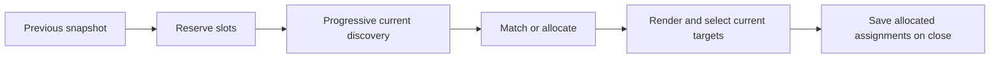

# Proposed design

## Components and boundaries

Add one metadata-only Navigation registry owned by the factory. Its window LRU
uses the existing `cacheWindowCount` (default 5, maximum 20, 0 disables reuse).
Each window retains only the most recent allocated snapshot, bounded by
`MaxTargets` control records and `MaxContainers` group records. Reuse must also
match the navigation viewport/capacity and configured VKey arrays; otherwise
start fresh. Factory replacement/disposal drops the registry.

Use exact identity matches from metadata already in responses. Do not add worker
requests/properties or interpret runtime IDs. A helper restart alone does not
clear parent-side assignments; a different captured window/process does.

## Program flow

1. Read the previous snapshot and reserve its slots for this activation.
2. Run normal progressive discovery and hierarchy planning without waiting.
3. For each current entry, reuse a matching level/entry slot; otherwise allocate
   the first free unreserved slot. Overflow uses existing paging.
4. Render and resolve key input through those explicit assignments, not list
   indices. Empty reserved slots reject input. Do not remap published entries.
5. On close, replace the snapshot with all assignments allocated during the
   activation, including off-page entries and previously visited levels, if a
   usable frame was received. A scan with no usable frames preserves the prior
   snapshot; a valid NoTargets result clears it. Late retired frames cannot save.

Reservations last only this activation. Controls not seen in a partial/cancelled
scan may lose their remembered assignments next time; this is not evidence that
they disappeared. Do not add missing-control TTLs or multi-generation history.
No reservation is released mid-activation to reclaim a visible label.

## Groups, schemes and holes

Keep normal hierarchy planning. Reuse a group's key/child assignments only when
its member identities and nested structure match exactly. Different discovery
batches may form different groups: those groups receive fresh assignments.
Unaffected root-level controls remain eligible for reuse.

Keep a reused level's single/pair scheme. Growth uses overflow pages instead of
changing already assigned keys; new levels follow existing adaptive behavior.
Sparse pages may contain holes. Pin the active logical page independently of
its displayed number, so a late earlier page cannot replace the current view,
prefix or selection. Skip entirely empty pages without moving entries between
logical pages; their displayed page number can change. Stable combo
means the same keys in the same matched level, not a guaranteed number of paging
keystrokes after other controls disappear.

Resizing/scoping, changed key arrays, changed grouping and LRU eviction may reset
assignments between activations. Existing explicit relayout behavior may reset
the active layout; ordinary discovery batches must not.
