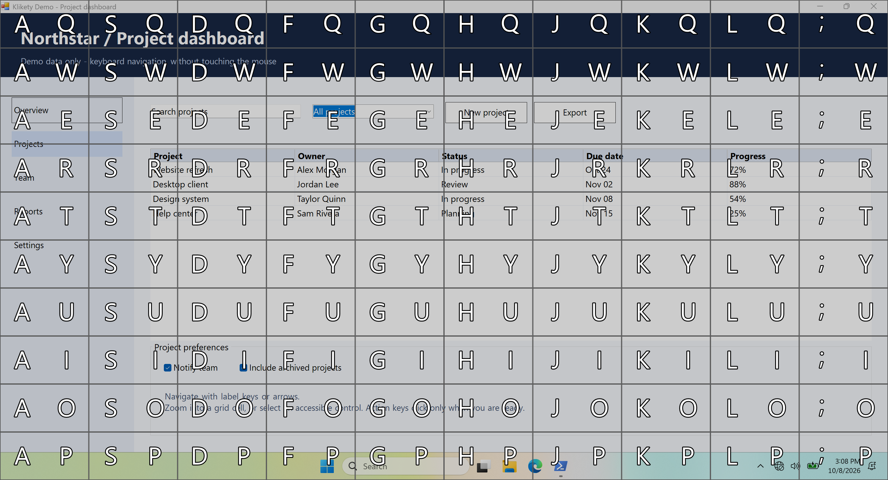
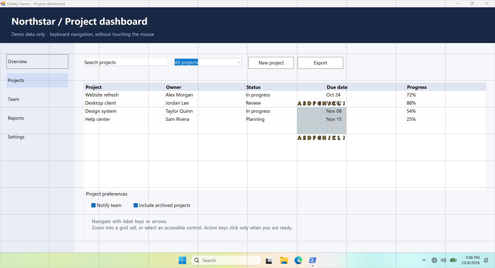
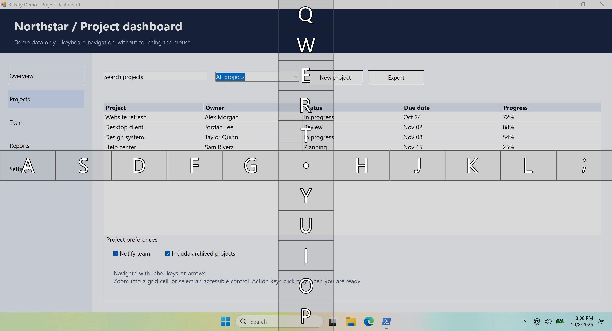
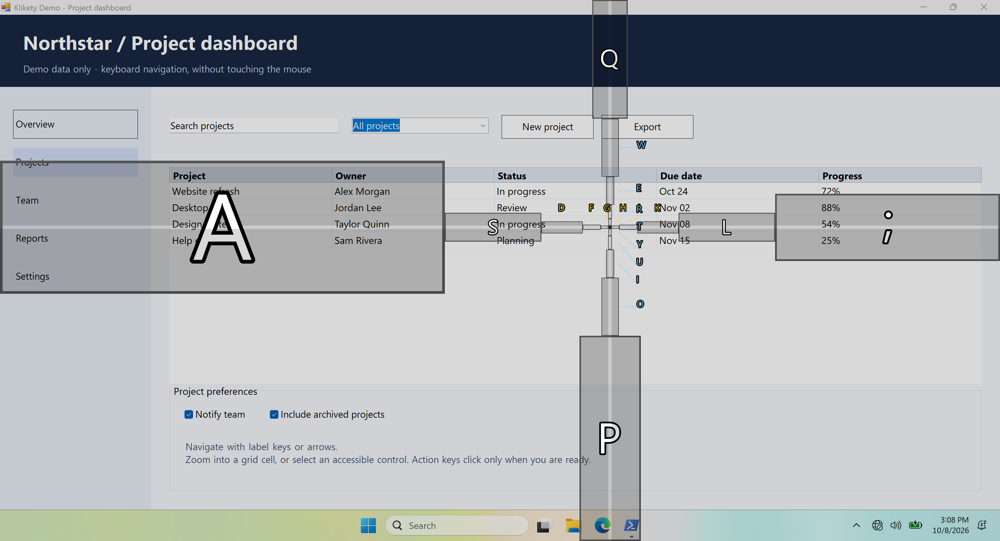
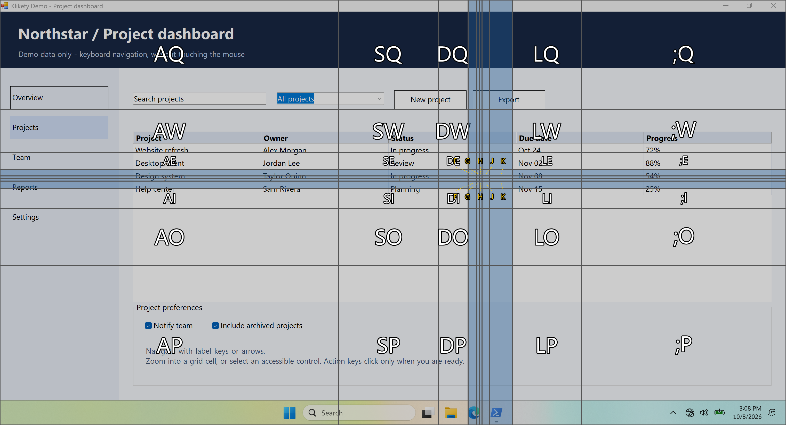
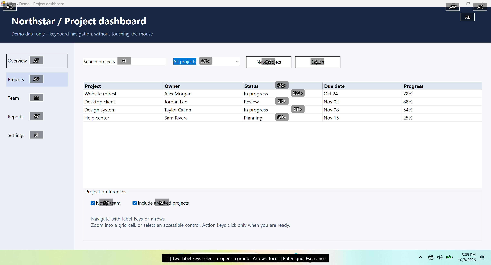
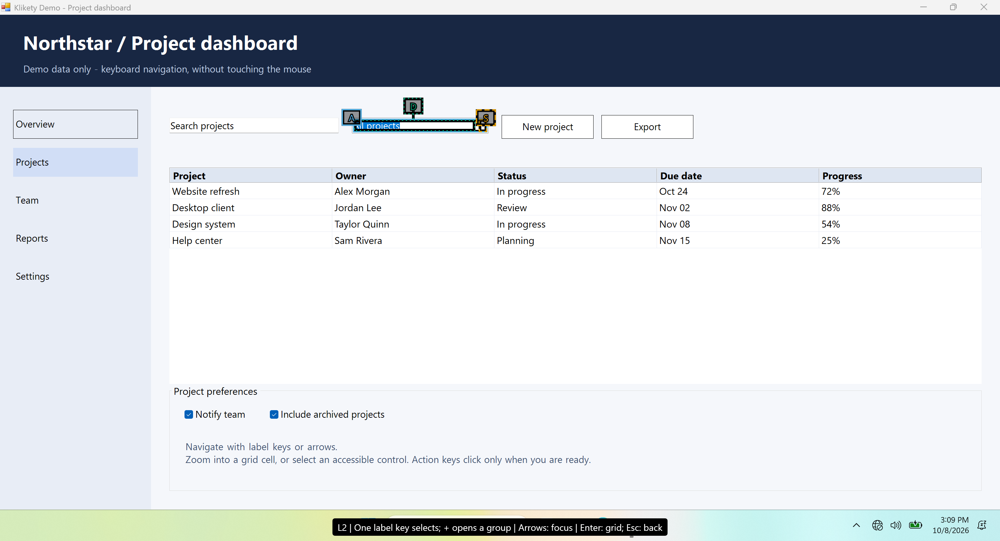

# Navigation

[Documentation](README.md) | [Getting started](getting-started.md) | [Settings](settings.md)

Press **Alt+Space** to open the default mode. Before navigating locks the mode,
use a mode chord to switch. All bindings here describe the first-run config;
Settings can change them. Shared ordered horizontal and vertical key lists drive
the labels; custom or migrated configs need not use a 10 by 10 grid.

## Modes in pictures

These are real production overlays over a synthetic demo application in an
offline Windows Sandbox. Expand a mode for native screenshots, then open an
image for full-size labels. They illustrate navigation and cursor previews,
not clicks or universal application compatibility.
[Capture procedure and provenance](design-notes/readme-demo.design.md).

<details>
<summary><strong>UniformGrid</strong> - two-key cells and progressively finer subgrids</summary>

The default grid has ten columns (`ASDFGHJKL;`) and ten rows (`QWERTYUIOP`).
Type a column key and a row key; repeat in the smaller L2/L3 grids for finer
targeting. Optional arrows move the highlighted cell, and Enter refines it.
The Level-3 threshold controls when the third grid is available.




</details>

<details>
<summary><strong>Crosshair</strong> - uniform horizontal and vertical axes</summary>

Open navigation, then press **N**. Axis keys select an intersection; Enter
opens a finer subgrid.



</details>

<details>
<summary><strong>LogCrosshair</strong> - small steps nearby, larger steps farther away</summary>

Open navigation, then press **M**. Logarithmic axes are centered on the cursor
and recenter as you move. Cells grow farther from the center; small labels
fan out for readability.



</details>

<details>
<summary><strong>LogGrid</strong> - logarithmic cells with iterative recentering</summary>

Open navigation, then press **comma**. Each two-key selection moves the cursor
and recomputes the grid. Cells grow geometrically away from the cursor, and
very small boundary cells collapse. An action key is still required to click.



</details>

<details>
<summary><strong>ElementHints</strong> - control labels and nested action groups</summary>

Enable ElementHints in Settings, open navigation, then press **Tab**.
Type a control label to select it or a `+` label to open its group.
Small groups use one key; this combo box exposes its own action, button, and
edit field without dropping any target. Enter always returns to grid.
Badges and control outlines share colors and solid/dashed/dotted patterns;
displaced badges have matching leader lines, so color is not the only cue.




</details>

## Actions and app scope

Selecting a location previews the cursor, **without clicking**. Press **Space**
for left-click, **X** for double-click, **C** for middle-click, **V** for
right-click, or **B** for move-only. Hold Shift, Ctrl, or Alt while pressing an
action key for a modified click. Bindings are configurable.

For drag-and-drop, choose the start point and press **Z**, choose the endpoint,
then press the action key for the mouse button. Left, right, and middle drags
and modifiers are supported.

Press **period** before navigating to scope the overlay to the foreground
application window. Off-screen portions are clipped to the navigation display.
All five modes can work within that area. Set `appScope.chordKey` to `null`
to disable this chord.

Labels follow the foreground application's active keyboard layout, including
DVORAK and Colemak. The VKey arrays describe physical key positions; changing
layouts does not require replacing them with printed letters. For custom
positions, edit the axes in Settings. Keep them disjoint and avoid action,
mode, help, scope, macro, and reserved keys. Labels scale with cells and use
outlined text; small cells can place labels outside with connector lines.

## Contextual help

Press **slash** or **question mark** while navigating to see the effective
commands on a split keyboard. The same key or Escape closes help without
acting or losing the selection. Other non-modifier keys close help and run
normally from the current state; modifiers alone leave it open.

Help reflects configured actions, label scheme, mode, focus/selection, drag
state, and fallback. It refreshes when ElementHints discovery finishes.
The help key and optional Shift requirement are configurable.

## ElementHints (opt-in)

Enable **Settings > Navigation > Element hints**, then **Save & apply**.
Keep UniformGrid enabled for fallback. Migration to config version 9 leaves
hints off and preserves existing defaults/bindings; conflicts are reported,
not rebound.

For a manual JSONC edit, merge this block into `modes`, then Reload from the
tray or restart:

```jsonc
"elementHints": {
  "enabled": true,
  "default": false,
  "chordKey": "Tab",
  "twoKey": true,
  "arrowKeys": true,
  "discoveryTimeoutMs": 1500
}
```

Small levels use one horizontal label key; larger levels use horizontal/vertical
pairs. A `+` badge opens a group that retains parent actions and independent
children. Large target sets use suitable UIA containers or capacity groups
(250 flat targets, for example, become three groups of up to 100 controls).
Groups are navigation-only and cannot receive mouse actions.

Arrow keys focus entries within the level, not pages. Disabling arrows does
not disable label navigation. PgUp/PgDn handle rare paging when a useful level
cannot fit. Escape clears an incomplete label, otherwise returns to the parent
level or cancels at L1. **Enter returns to grid**, including while loading, after
failure, or after mode lock. Macro setup prompts must finish before navigation
keys can run.

Hints stay near controls. Nested badges use matched outlines, border patterns,
and placement; coincident outlines are inset separately. Black halos preserve
contrast. Focus/selection shows the control's role/actions in the footer; extreme
layouts fall back to a scrolling role list. Ordinary levels show displacement
guides only for the selected target. Badge fills are translucent, and a centered
spinner indicates discovery.

### Discovery, safety, and compatibility

Discovery scans only the application window captured before the overlay,
clipped to the navigation display/scope. Its default **1500 ms** deadline
includes worker startup. For slow providers such as Word, try **10000 ms** in
**Settings > Navigation > Element hints > Discovery timeout (ms)**. The valid
range is 100-60000 ms. Enter/Escape remain available while waiting.

Traversal stays bounded at 20000 nodes, depth 64, and 2000 targets. The independent
action-validation and cleanup deadlines remain 500 ms. Partial, empty, timeout,
provider, and permission outcomes remain visible.

Before input, the helper rechecks target identity, geometry, and point ownership.
Moved, replaced, covered, or unavailable targets receive no input; reopen hints
or use grid. Move-only may use a verified interactive descendant; clicks/drags
retain stricter ownership checks. Macros remain coordinate-based, not semantic
UIA recordings.

No accessibility names, text values, or document contents are collected.
Processing is local in the bundled `uia-worker`; no elevation, UIAccess,
browser flags, or remote service is required. Missing helper files affect
hints, not grid startup; copy the whole published folder.

Not every app exposes usable UIA controls. Third-party physical-input coverage
and mixed-display/mixed-DPI compatibility are not guaranteed; native human
verification gates remain open. Screenshots are warmed-provider illustration,
not evidence that every app fits the default discovery deadline.
